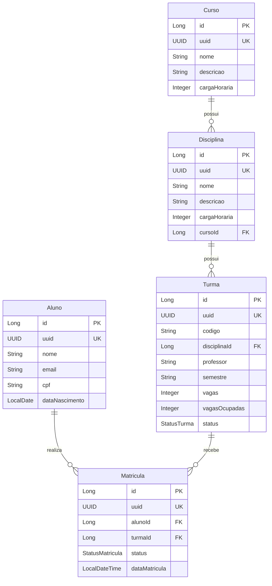

# Modelo de Dominio

## Entidades Sugeridas

O desafio define 5 entidades principais que formam o nucleo do sistema de matricula online.

### Identificadores: id interno + uuid publico

Todas as entidades seguem o padrao **duplo identificador**:

| Campo | Tipo | Uso |
|-------|------|-----|
| `id` | Long | PK interna. Usada em FKs, indices e joins. **Nunca exposta** na API (DTOs, path params, responses). |
| `uuid` | UUID | Identificador publico unico. Usado em **todas** as rotas e respostas dos endpoints. |

**Motivo:** evitar enumeracao e exposicao de IDs sequenciais; manter performance de FK com `BIGINT` no banco.

---

### Aluno

| Atributo | Tipo | Descricao |
|----------|------|-----------|
| id | Long | PK interna (nao exposta) |
| uuid | UUID | Identificador publico (unico) |
| nome | String | Nome completo do aluno |
| email | String | Email do aluno (unico) |
| cpf | String | CPF do aluno (unico) |
| dataNascimento | LocalDate | Data de nascimento |
| createdAt | LocalDateTime | Data de criacao do registro |
| updatedAt | LocalDateTime | Data de atualizacao do registro |

### Curso

| Atributo | Tipo | Descricao |
|----------|------|-----------|
| id | Long | PK interna (nao exposta) |
| uuid | UUID | Identificador publico (unico) |
| nome | String | Nome do curso |
| descricao | String | Descricao do curso |
| cargaHoraria | Integer | Carga horaria total em horas |
| createdAt | LocalDateTime | Data de criacao do registro |
| updatedAt | LocalDateTime | Data de atualizacao do registro |

### Disciplina

| Atributo | Tipo | Descricao |
|----------|------|-----------|
| id | Long | PK interna (nao exposta) |
| uuid | UUID | Identificador publico (unico) |
| nome | String | Nome da disciplina |
| descricao | String | Descricao da disciplina |
| cargaHoraria | Integer | Carga horaria em horas |
| curso | Curso | Curso ao qual a disciplina pertence |
| createdAt | LocalDateTime | Data de criacao do registro |
| updatedAt | LocalDateTime | Data de atualizacao do registro |

### Turma

| Atributo | Tipo | Descricao |
|----------|------|-----------|
| id | Long | PK interna (nao exposta) |
| uuid | UUID | Identificador publico (unico) |
| codigo | String | Codigo identificador da turma |
| disciplina | Disciplina | Disciplina da turma |
| professor | String | Nome do professor responsavel |
| semestre | String | Semestre letivo (ex: 2025.1) |
| vagas | Integer | Numero total de vagas |
| vagasOcupadas | Integer | Numero de vagas ja ocupadas |
| status | StatusTurma | ABERTA ou FECHADA |
| createdAt | LocalDateTime | Data de criacao do registro |
| updatedAt | LocalDateTime | Data de atualizacao do registro |

### Matricula

| Atributo | Tipo | Descricao |
|----------|------|-----------|
| id | Long | PK interna (nao exposta) |
| uuid | UUID | Identificador publico (unico) |
| aluno | Aluno | Aluno matriculado |
| turma | Turma | Turma na qual o aluno esta matriculado |
| status | StatusMatricula | PENDENTE, CONFIRMADA ou CANCELADA |
| dataMatricula | LocalDateTime | Data em que a matricula foi realizada |
| createdAt | LocalDateTime | Data de criacao do registro |
| updatedAt | LocalDateTime | Data de atualizacao do registro |

## Enums

### StatusMatricula

| Valor | Descricao |
|-------|-----------|
| PENDENTE | Matricula criada mas ainda nao confirmada |
| CONFIRMADA | Matricula confirmada, vaga consumida |
| CANCELADA | Matricula cancelada, vaga liberada (se estava confirmada) |

### StatusTurma

| Valor | Descricao |
|-------|-----------|
| ABERTA | Turma aceitando matriculas |
| FECHADA | Turma nao aceita mais matriculas |

## Diagrama de Relacionamentos



## Relacionamentos

| Origem | Destino | Tipo | Descricao |
|--------|---------|------|-----------|
| Curso | Disciplina | 1:N | Um curso possui varias disciplinas |
| Disciplina | Turma | 1:N | Uma disciplina pode ter varias turmas |
| Aluno | Matricula | 1:N | Um aluno pode ter varias matriculas |
| Turma | Matricula | 1:N | Uma turma pode ter varias matriculas |
| Aluno + Turma | Matricula | Unique | Um aluno nao pode ter duas matriculas ativas na mesma turma |

## Convencao na API

| Camada | Identificador |
|--------|---------------|
| Banco / JPA / FKs | `id` (Long) |
| Path params, query refs, DTOs de request/response | `uuid` (UUID) |

Exemplo de response:

```json
{
  "uuid": "a3f1c8e2-4b5d-4e9a-9c1f-2d8e7a6b5c4d",
  "nome": "Maria Silva",
  "email": "maria@email.com"
}
```

Referencias entre recursos nos DTOs tambem usam UUID (ex: criar matricula envia `alunoUuid` e `turmaUuid`).
