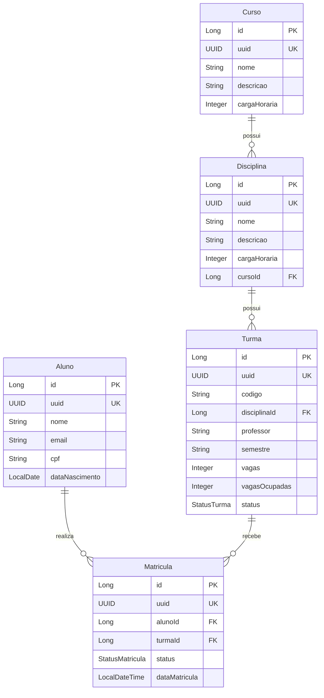

# Modelo de Domínio

## Entidades Sugeridas

O desafio define 5 entidades principais que formam o núcleo do sistema de matrícula online.

### Identificadores: id interno + uuid público

Todas as entidades seguem o padrão **duplo identificador**:

| Campo | Tipo | Uso |
|-------|------|-----|
| `id` | Long | PK interna. Usada em FKs, índices e joins. **Nunca exposta** na API (DTOs, path params, responses). |
| `uuid` | UUID | Identificador público único. Usado em **todas** as rotas e respostas dos endpoints. |

**Motivo:** evitar enumeração e exposição de IDs sequenciais; manter performance de FK com `BIGINT` no banco.

---

### Aluno

| Atributo | Tipo | Descrição |
|----------|------|-----------|
| id | Long | PK interna (não exposta) |
| uuid | UUID | Identificador público (único) |
| nome | String | Nome completo do aluno |
| email | String | Email do aluno (único) |
| cpf | String | CPF do aluno (único) |
| dataNascimento | LocalDate | Data de nascimento |
| createdAt | LocalDateTime | Data de criação do registro |
| updatedAt | LocalDateTime | Data de atualização do registro |

### Curso

| Atributo | Tipo | Descrição |
|----------|------|-----------|
| id | Long | PK interna (não exposta) |
| uuid | UUID | Identificador público (único) |
| nome | String | Nome do curso |
| descricao | String | Descrição do curso |
| cargaHoraria | Integer | Carga horária total em horas |
| createdAt | LocalDateTime | Data de criação do registro |
| updatedAt | LocalDateTime | Data de atualização do registro |

### Disciplina

| Atributo | Tipo | Descrição |
|----------|------|-----------|
| id | Long | PK interna (não exposta) |
| uuid | UUID | Identificador público (único) |
| nome | String | Nome da disciplina |
| descricao | String | Descrição da disciplina |
| cargaHoraria | Integer | Carga horária em horas |
| curso | Curso | Curso ao qual a disciplina pertence |
| createdAt | LocalDateTime | Data de criação do registro |
| updatedAt | LocalDateTime | Data de atualização do registro |

### Turma

| Atributo | Tipo | Descrição |
|----------|------|-----------|
| id | Long | PK interna (não exposta) |
| uuid | UUID | Identificador público (único) |
| codigo | String | Código identificador da turma |
| disciplina | Disciplina | Disciplina da turma |
| professor | String | Nome do professor responsável |
| semestre | String | Semestre letivo (ex: 2025.1) |
| vagas | Integer | Número total de vagas |
| vagasOcupadas | Integer | Número de vagas já ocupadas |
| status | StatusTurma | ABERTA ou FECHADA |
| createdAt | LocalDateTime | Data de criação do registro |
| updatedAt | LocalDateTime | Data de atualização do registro |

### Matrícula

| Atributo | Tipo | Descrição |
|----------|------|-----------|
| id | Long | PK interna (não exposta) |
| uuid | UUID | Identificador público (único) |
| aluno | Aluno | Aluno matriculado |
| turma | Turma | Turma na qual o aluno está matriculado |
| status | StatusMatricula | PENDENTE, CONFIRMADA ou CANCELADA |
| dataMatricula | LocalDateTime | Data em que a matrícula foi realizada |
| createdAt | LocalDateTime | Data de criação do registro |
| updatedAt | LocalDateTime | Data de atualização do registro |

## Enums

### StatusMatricula

| Valor | Descrição |
|-------|-----------|
| PENDENTE | Matrícula criada mas ainda não confirmada |
| CONFIRMADA | Matrícula confirmada, vaga consumida |
| CANCELADA | Matrícula cancelada, vaga liberada (se estava confirmada) |

### StatusTurma

| Valor | Descrição |
|-------|-----------|
| ABERTA | Turma aceitando matrículas |
| FECHADA | Turma não aceita mais matrículas |

## Diagrama de Relacionamentos



## Relacionamentos

| Origem | Destino | Tipo | Descrição |
|--------|---------|------|-----------|
| Curso | Disciplina | 1:N | Um curso possui várias disciplinas |
| Disciplina | Turma | 1:N | Uma disciplina pode ter várias turmas |
| Aluno | Matrícula | 1:N | Um aluno pode ter várias matrículas |
| Turma | Matrícula | 1:N | Uma turma pode ter várias matrículas |
| Aluno + Turma | Matrícula | Unique | Um aluno não pode ter duas matrículas ativas na mesma turma |

## Convenção na API

| Camada | Identificador |
|--------|---------------|
| Banco / JPA / FKs | `id` (Long) |
| Path params, query refs, DTOs de request/response | `uuid` (UUID) |

Exemplo de response:

```json
{
  "uuid": "a3f1c8e2-4b5d-4e9a-9c1f-2d8e7a6b5c4d",
  "nome": "Maria Silva",
  "email": "maria@email.com"
}
```

Referências entre recursos nos DTOs também usam UUID (ex: criar matrícula envia `alunoUuid` e `turmaUuid`).
