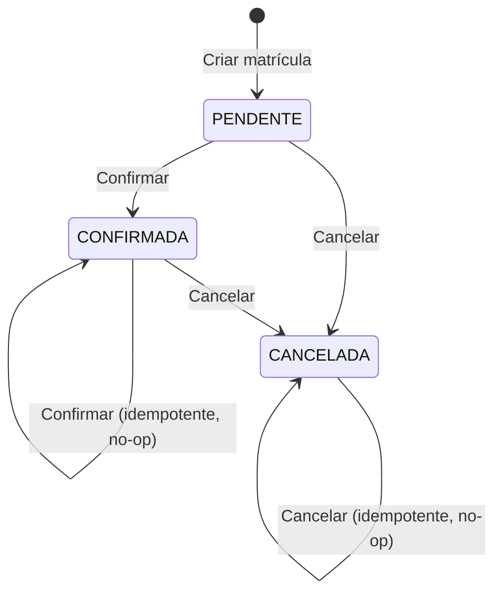

# Regras de Negócio

## Visão Geral

O sistema de matrículas acadêmicas possui 7 regras de negócio mínimas que devem ser implementadas e testadas. Estas regras são o núcleo da avaliação técnica.

---

## RN01 - Matrícula apenas em turma aberta

**Descrição:** Um aluno só pode ser matriculado em turmas com status ABERTA.

**Comportamento esperado:**
- Ao tentar matricular um aluno, verificar se a turma possui `status = ABERTA`.
- Se a turma estiver FECHADA, a operação deve ser rejeitada com mensagem clara.

**Cenários:**
| Cenário | Resultado esperado |
|---------|-------------------|
| Turma ABERTA com vagas | Matrícula criada com sucesso |
| Turma FECHADA | Erro: "Turma não está aberta para matrículas" |

---

## RN02 - Limite de vagas da turma

**Descrição:** Uma turma possui limite de vagas. Não é possível matricular além do limite.

**Comportamento esperado:**
- Antes de confirmar uma matrícula, verificar se `vagasOcupadas < vagas`.
- Se não houver vagas disponíveis, a operação deve ser rejeitada.
- A verificação deve ser **protegida contra concorrência** (tratamento transacional).

**Cenários:**
| Cenário | Resultado esperado |
|---------|-------------------|
| Turma com vagas disponíveis | Matrícula permitida |
| Turma lotada (vagasOcupadas == vagas) | Erro: "Não há vagas disponíveis nesta turma" |
| Duas requisições simultâneas para última vaga | Apenas uma deve ser aceita |

**Ponto crítico:** Esta regra será questionada na entrevista. Deve haver proteção transacional (ex: `@Transactional` + lock otimista/pessimista ou controle no banco).

---

## RN03 - Matrícula duplicada

**Descrição:** Um aluno não pode se matricular duas vezes na mesma turma.

**Comportamento esperado:**
- Antes de criar uma matrícula, verificar se já existe uma matrícula ativa (PENDENTE ou CONFIRMADA) do mesmo aluno na mesma turma.
- Se já existir, a operação deve ser rejeitada.

**Cenários:**
| Cenário | Resultado esperado |
|---------|-------------------|
| Aluno sem matrícula na turma | Matrícula criada |
| Aluno com matrícula PENDENTE na turma | Erro: "Aluno já possui matrícula nesta turma" |
| Aluno com matrícula CONFIRMADA na turma | Erro: "Aluno já possui matrícula nesta turma" |
| Aluno com matrícula CANCELADA na turma | Matrícula permitida (nova matrícula) |

---

## RN04 - Status da matrícula

**Descrição:** Uma matrícula possui status que segue um fluxo definido: PENDENTE, CONFIRMADA ou CANCELADA.

**Comportamento esperado:**
- Ao criar uma matrícula, o status inicial é PENDENTE.
- Transições com efeito: PENDENTE -> CONFIRMADA, PENDENTE -> CANCELADA, CONFIRMADA -> CANCELADA.
- **Idempotência:** confirmar uma matrícula já CONFIRMADA ou cancelar uma já CANCELADA deve retornar **sucesso sem alterar o banco** (no-op).
- Transição inválida a rejeitar: CANCELADA -> CONFIRMADA (não é permitido "reativar" via confirmar).

**Fluxo de status:**

---

## RN05 - Consumo de vaga ao confirmar

**Descrição:** Ao confirmar uma matrícula, a vaga da turma deve ser consumida.

**Comportamento esperado:**
- Ao mudar o status de PENDENTE para CONFIRMADA, incrementar `vagasOcupadas` na turma.
- Verificar se ainda há vagas antes de confirmar.
- A operação deve ser atômica (transacional).
- Se a matrícula **já estiver CONFIRMADA**, retornar sucesso **sem** alterar status nem `vagasOcupadas` (idempotente).

**Cenários:**
| Cenário | Resultado esperado |
|---------|-------------------|
| Confirmar matrícula PENDENTE com vagas | Status muda para CONFIRMADA, vagasOcupadas++ |
| Confirmar matrícula PENDENTE sem vagas | Erro: "Não há vagas disponíveis" |
| Confirmar matrícula já CONFIRMADA | Sucesso HTTP 200; banco inalterado (no-op) |
| Confirmar matrícula CANCELADA | Erro: não é permitido confirmar matrícula cancelada |

---

## RN06 - Liberação de vaga ao cancelar

**Descrição:** Ao cancelar uma matrícula que estava CONFIRMADA, a vaga deve ser liberada.

**Comportamento esperado:**
- Ao mudar o status de CONFIRMADA para CANCELADA, decrementar `vagasOcupadas` na turma.
- Ao cancelar uma matrícula PENDENTE, **não alterar** vagasOcupadas (vaga não havia sido consumida).
- Se a matrícula **já estiver CANCELADA**, retornar sucesso **sem** alterar status nem `vagasOcupadas` (idempotente).

**Cenários:**
| Cenário | Resultado esperado |
|---------|-------------------|
| Cancelar matrícula CONFIRMADA | Status muda para CANCELADA, vagasOcupadas-- |
| Cancelar matrícula PENDENTE | Status muda para CANCELADA, vagasOcupadas inalterado |
| Cancelar matrícula já CANCELADA | Sucesso HTTP 200; banco inalterado (no-op) |

---

## RN07 - Consultas de matrículas

**Descrição:** Deve haver consulta de matrículas por aluno e por turma.

**Comportamento esperado:**
- Endpoint para listar todas as matrículas de um aluno específico.
- Endpoint para listar todas as matrículas de uma turma específica.
- Os resultados devem incluir informações relevantes (dados do aluno, turma, status da matrícula).

**Endpoints sugeridos:**
| Método | Endpoint | Descrição |
|--------|----------|-----------|
| GET | `/api/matriculas/aluno/{alunoUuid}?page&size&status` | Matrículas de um aluno (paginado) |
| GET | `/api/matriculas/turma/{turmaUuid}?page&size&status` | Matrículas de uma turma (paginado) |
| GET | `/api/matriculas?page&size&status` | Listagem geral com filtro de status (paginado) |

---

## Resumo das Regras

| ID | Regra | Prioridade |
|----|-------|-----------|
| RN01 | Matrícula apenas em turma aberta | Crítica |
| RN02 | Limite de vagas | Crítica |
| RN03 | Matrícula duplicada | Crítica |
| RN04 | Status da matrícula (fluxo) | Crítica |
| RN05 | Consumo de vaga ao confirmar | Crítica |
| RN06 | Liberação de vaga ao cancelar | Crítica |
| RN07 | Consultas por aluno e por turma | Obrigatória |
