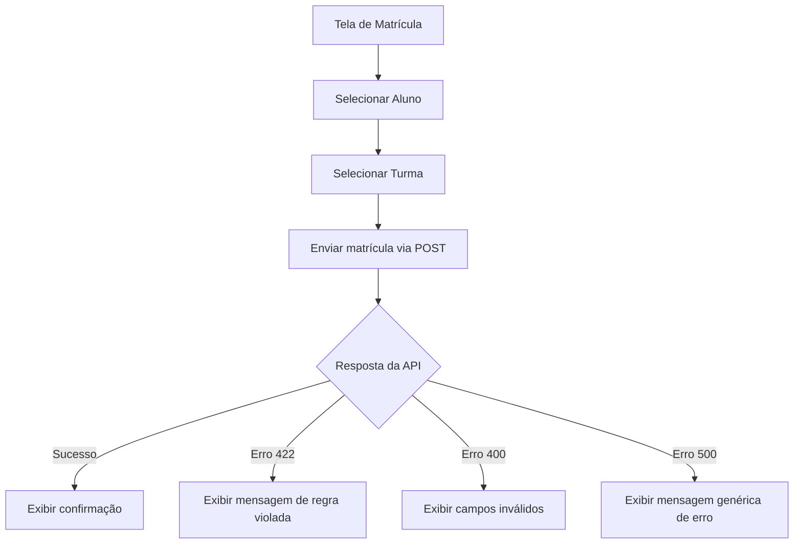
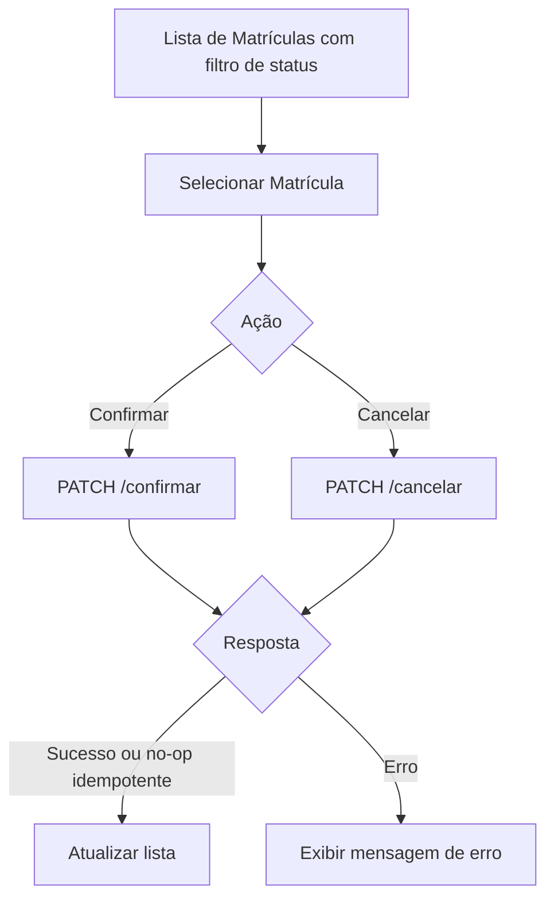

# Requisitos do Frontend

## Stack

**Angular 22** (TypeScript) com **Node.js 24** (Active LTS) — escolha fechada para este projeto.

## Requisitos Obrigatórios

### Estrutura com Componentes

- O frontend deve ser **estruturado com componentes** reutilizáveis.
- Cada funcionalidade/tela deve ter seus próprios componentes.
- Separação clara entre componentes de apresentação e lógica.

### Telas Separadas

O frontend deve conter telas para as principais funcionalidades:

| Tela | Descrição |
|------|-----------|
| **Alunos** | Listagem, cadastro, edição e exclusão de alunos |
| **Cursos** | Listagem, cadastro, edição e exclusão de cursos |
| **Disciplinas** | Listagem, cadastro, edição e exclusão de disciplinas |
| **Turmas** | Listagem, cadastro, edição e exclusão de turmas |
| **Matrículas** | Realizar matrícula, confirmar, cancelar, consultar por aluno e por turma |

### Filtro e paginação na tela de Matrículas (obrigatório)

A listagem de matrículas deve permitir:

| Controle | Comportamento |
|----------|---------------|
| **Filtro por status** | Todos / PENDENTE / CONFIRMADA / CANCELADA |
| **Paginação** | Navegação de páginas consumindo `page`/`size` da API |

- Usar `GET /api/matriculas?status=PENDENTE&page=0&size=20` (ou equivalente).
- Demais listagens (alunos, cursos, disciplinas, turmas) também devem respeitar a paginação da API.
- Comportamento idempotente: confirmar já CONFIRMADA ou cancelar já CANCELADA retorna sucesso (ver [02-regras-negocio.md](02-regras-negocio.md)).

### Tratamento de Erros

- Exibir mensagens de erro claras ao usuário quando a API retornar erros.
- Tratar erros de validação (400) mostrando os campos inválidos.
- Tratar erros de regra de negócio (422/409) com mensagem compreensível.
- Tratar erros de rede/servidor (500) com mensagem genérica amigável.
- Evitar telas em branco ou travamentos em caso de falha.

### Consumo Organizado da API

- Centralizar chamadas HTTP em **services** dedicados (um por entidade ou domínio).
- Não fazer chamadas HTTP diretamente nos componentes.
- Usar tipagem adequada para requests e responses.

## Estrutura Sugerida (Angular)

```
src/app/
├── components/
│   ├── aluno/
│   │   ├── aluno-list/
│   │   ├── aluno-form/
│   │   └── aluno-detail/
│   ├── curso/
│   ├── disciplina/
│   ├── turma/
│   └── matricula/
│       ├── matricula-list/
│       ├── matricula-form/
│       └── matricula-por-aluno/
├── services/
│   ├── aluno.service.ts
│   ├── curso.service.ts
│   ├── disciplina.service.ts
│   ├── turma.service.ts
│   └── matricula.service.ts
├── models/
│   ├── aluno.model.ts
│   ├── curso.model.ts
│   ├── disciplina.model.ts
│   ├── turma.model.ts
│   └── matricula.model.ts
├── shared/
│   ├── error-handler/
│   └── notification/
└── app-routing.module.ts
```

## Fluxos Principais

### Fluxo de Matrícula



### Fluxo de Confirmação/Cancelamento



## Pontos de Atenção

- O frontend será avaliado quanto a **organização e fluxo de uso**, não apenas se funciona.
- O **tratamento de erros** no frontend é item de avaliação crítica.
- Não é necessário design sofisticado, mas deve ser **funcional e navegável**.
- Boa organização do frontend é listada como **diferencial**.
- Todas as navegações e chamadas HTTP usam **`uuid`** do recurso (nunca `id` numérico interno). Ver [01-modelo-dominio.md](01-modelo-dominio.md).
